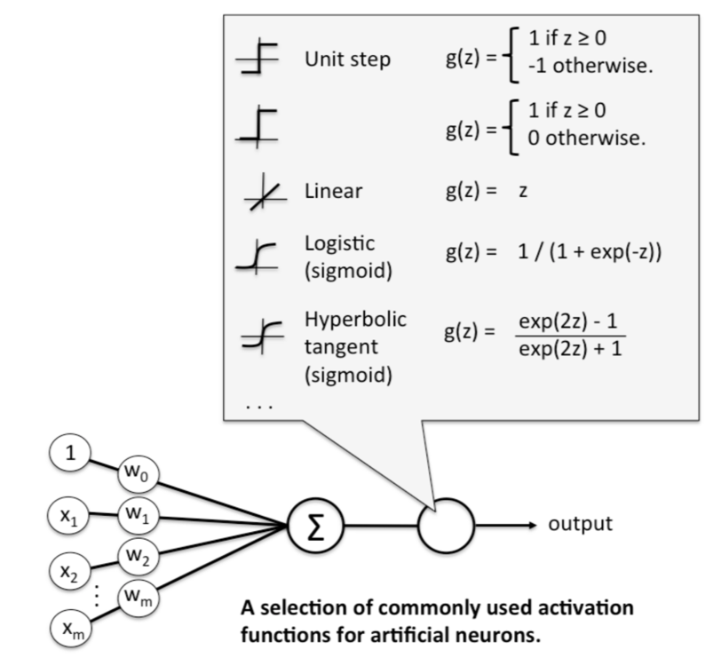
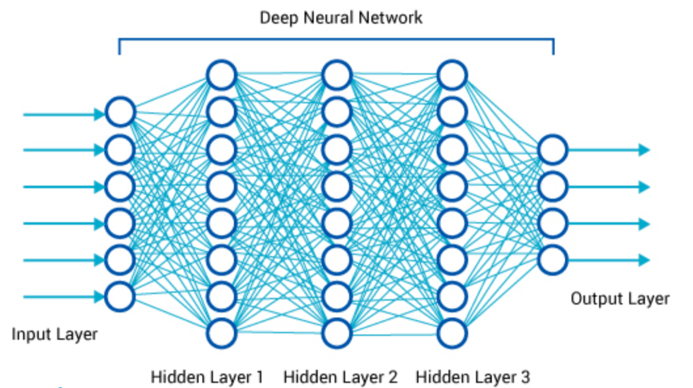

```{r setup, include=FALSE, cache=FALSE}
# Set global R options
options(htmltools.dir.version = FALSE, servr.daemon = TRUE)
# Set global knitr chunk options
knitr::opts_chunk$set(
  fig.align = "center", 
  #cache = TRUE,
  error = FALSE,
  message = FALSE, 
  warning = FALSE, 
  collapse = TRUE,
  eval = FALSE
)
library(ggplot2)
# This is good for getting the ggplot background consistent with
# the html background color
thm <- theme_bw() + 
  theme(
    panel.background = element_rect(fill = "transparent", colour = NA), 
    plot.background = element_rect(fill = "transparent", colour = NA),
    legend.position = "top",
    legend.background = element_rect(fill = "transparent", colour = NA),
    legend.key = element_rect(fill = "transparent", colour = NA)
  )
theme_set(thm)


```

class: title-slide   
<a href="https://github.com/dlab-berkeley/Deep-Learning-in-R"></a>


<br><br><br><br>
# .font130[Introduction to Deep Learning in R]

### Evan Muzzall and Chris Kennedy  
### March 18, 2019

---

class: center, middle, inverse

# "It’s tough to make predictions, especially about the future." -Yogi Berra

---

# Software requirements

[Install R 3.4 or greater](https://cloud.r-project.org/)   

[Install RStudio](https://www.rstudio.com/products/rstudio/download/)  

[Install Anaconda Python (3.7+)](https://www.anaconda.com/download/#macos) if you have not already done so. Use default options.  

---

# Download materials

[Download the workshop materials](https://github.com/dlab-berkeley/Deep-Learning-in-R)
  * Click green “Clone or Download” button
  * Click “Download Zip”
  * Extract this zip file to your Dropbox / Box / etc. and double-click the Rproj file.
  
Or (advanced):
  * Copy the github clone URL (https or ssh version)
  * In RStudio select File -> New Project -> Version Control -> Git and paste the repository URL

---

# R packages

## Install keras by typing in the RStudio console or an R script:

```{r}
install.packages("keras")  
library(keras)
install_keras()  
```

## Install key additional packages:  

### Image Magick  

```{r}
install.packages("magick")
library(magick)
```

(MacOS Homebrew or Linux users, [see extra install info here](https://cran.r-project.org/web/packages/magick/vignettes/intro.html#build_from_source))

---

Also, install the following packages:
```{r}
install.packages(c("cowplot", "dplyr", "ggplot2"))
```

---

class: left

# Workshop Goals

### Introduction  
### Part 1. MNIST handwritten digit classification example  
### Part 2. Dog-human example  
### Part 3. Biomedical example  
### Part 4. Cloud example

---

# What is deep learning? (long)

#### Deep Learning allows "computers to learn from experience and understand the world in terms of a hierarchy of concepts, with each concept defined through its relation to simpler concepts. By gathering knowledge from experience, this approach avoids the need for human operators to formally specify all the knowledge that the computer needs.  

#### The hierarchy of concepts enables the computer to learn complicated concepts by building them out of simpler ones. If we draw a graph showing how these concepts are built on top of each other, the graph is deep, with many layers. For this reason, we call this approach to AI deep learning."  

#### (https://www.deeplearningbook.org/contents/intro.html, pp. 1-2)

---

# What is deep learning? (short)

### - A subfield of machine learning that utilizes multi-layered artificial neural networks for modelling and prediction of data. 

### - These models can be applied to numeric, categorical, image, text, audio, and time-series data. 

### - For images, neural networks import the image as a matrix of pixel values. Therefore it is useful to think of images as giant matrices! 

---

class: center

# What is an artificial neural network? 

"Perceptron"
```{r, out.width = "600px", echo = F, eval = TRUE}
knitr::include_graphics("slide_img/ann.png")
```

---

# Key concepts
.pull-left[
1) Images are preprocessed 
- Size
- Tensor reshape  
- Image color profile

2) Training and validation sets are split
- Part 1: MNIST 
  - Train = 60000, val = 10000
- Dog-human 
  - Train = 600, val = 100

3) Define data characteristics
- Batch size
- Number of training and validation samples  
- Epochs
]

.pull-right[
4) Define the network
- Number of units in input, hidden, and output layers. 
- Activation functions
- Dropout

5) Compile:  
- Loss function  
- Optimizer  
  - Learning rate
- Performance metric  

6) Train the model

7) Evaluate
]

---

class: center

# What is an activation function?

```{r, out.width = "500px", echo = F, eval = TRUE}

```

---

class: center

# What makes a neural network "deep"?

```{r, out.width = "700px", echo = F, eval = TRUE}

```

---

# How does it work? 

#### 1. Supervised neural networks require "features", or an **input layer** of data that is used to produce our estimated **output layer**, or estimated classification of an actual image.  

#### 2. This input layer is initialized with a vector of randomized weights and a bias term of "1" is added. 

#### 3. The products of these input features and their weights are summed and  transformed. This summed value is passed through an activation function to determine the threshold if our prediction should be classified as a 0 or a 1. A learning rate is also be specified. 

---

# How does it work? 

#### 4. Error is computed as target value minus our estimation. The weights delta metric (how much the errors should change) is calculated as the error times the slope of the point on the activation function times the vector of input features. 

#### 5. The vector of original weights is added to the vector of updated weights and are "backpropagated" (used as the recycled input) and passed through the model for another epoch.  

#### 6. With deep networks, the process also takes places between **hidden layers**, or areas of nonlinear transformations connected only to the layers before and after them. They are referred to as "hidden" because they are not show as the final output. 

---

# Part 1 functions

#### `data_mnist()`: Open prebuilt MNIST dataset

#### `array_reshape()`: Reshape, rescale, one-hot encode

#### `to_categorical()`: Convert y to factor type

#### `keras_model_sequential()`: Build the network

#### `layer_dense()`: Define number of units, input_shape, and activation function. 

#### `layer_dropout()`: Specify dropout rate

#### `compile()`: Compute loss function, optimizer, and metrics

#### `fit()`: Fit/build the model; (eval training set performance)

#### `evaluate()`: Evaluate test data performance

---

# Part 1

### Open Part1.Rmd to begin the coding walkthrough. 

---

class: center

# Part 1 - MNIST classification performance
**Training set**
```{r, out.width = "600px", echo = F, eval = TRUE}
knitr::include_graphics("slide_img/keras MNIST training data.png")
```
  
**Validation set**  
loss = 0.101398  
acc = 0.9817

---

# Part 1 Challenge
### Write down the steps you followed to run this model from start to finish. What does each part do? 

---

# Part 2

Now look at an example that is more realistic in terms of additional preprocessing that you will have to consider if you are using your own images. The MNIST dataset was already curated for us into training and test sets with defined $x$ and $y$ variables. 

This time however, try and classify raw images of dogs and people from the [Stanford Dogs](http://vision.stanford.edu/aditya86/ImageNetDogs/) and [INRIA Person](http://pascal.inrialpes.fr/data/human/) image databases. This time, the setup will be a little bit different. 

---

# Part 2 functions
#### `list_files()`: Returns ful path of images

#### `image_data_generator()`: Performs data augmentation

#### `flow_from_directory()`: Properly define variables for model fitting

#### `keras_model_sequential()`: Build the network

#### `layer_flatten()`, `layer_dense()`, `layer_dropout()`, `compile()`: What are these?  
(hint: the same as Part 1 except for one - which one?)

#### `fit_generator()`: Used to fit models to training data when `flow_from_directory()` is used

#### `evaluate_generator()`: Used to evaluate performance on validation sets when `flow_from_directory()` is used. 

---

# Part 2

### Open Part2.Rmd to begin the next walkthrough. 

---

# Part 2  

For the Part 2 example, we use two folders of [dogs](http://vision.stanford.edu/aditya86/ImageNetDogs/) and [people](http://pascal.inrialpes.fr/data/human/), located in training and validation directories. 

```{r}
train_path = "data-raw/dog-human/TRAIN"

val_path = "data-raw/dog-human/VAL"
```

## `list_files`
Listing the files prints the full file paths of our images.  

```{r}
train_images = list.files(train_path, full.names = TRUE, recursive = TRUE)

val_images = list.files(val_path, full.names = TRUE, recursive = TRUE)
```

---

# Part 2  

We can fit the model like before by defining the number of units in each layer, the activation function, etc. However we should also specify: 
- Image width and height  
- Batch size  
- Number of training samples  
- Number of validation samples  
- Epochs  

However, since we are using images stored in directories that were manually downloaded and not as part of a built-in example, the functions to be used will change slightly. 

---

# Part 2: `image_data_generator`
This function [performs data augmentation](https://keras.rstudio.com/reference/image_data_generator.html). It contains many tunable parameters, but we will just use it to rescale RGB color profile to the gray channel. 

---

# Part 2: `flow_from_directory`
Here we can configure the training model. You will need to define: 
- The file paths to the training and test data  
- Image shape  
- Batch size  
- Output class: binary
- Color profile: grayscale

> Remember this is a Pythonic "method"! 

---

# Part 2: `keras_model_sequential`

Fit the model! 

Same as Part 1, except we need to first flatten the three dimensional array to one dimension:  

```{r}
layer_flatten(input_shape = c(img_width, img_height, 1))
```

The `compile` step (loss function, activation function, and performance metric) is also similar to Part 1 except in Part 2 we use ["optimizer_adam"](https://en.wikipedia.org/wiki/Stochastic_gradient_descent#Adam) instead of ["optimizer_rmsprop"](https://en.wikipedia.org/wiki/Stochastic_gradient_descent#RMSProp). 

---

# Part 2: `fit_generator`

This fits the training model configuration (using `flow_from_directory`). Remember the jargon from earlier:  
- Steps per epoch: the number of batch runs to complete one full iteration of training.  
- Epochs: 
- Validation data: the validation model 
- Validation steps: the number of batch runs needed to complete one full iteration of validation.  

---

class: center

# Part 2: Dog-human classification performance
**Training Set**
```{r, out.width = "550px", echo = F, eval = TRUE}
knitr::include_graphics("slide_img/Part 2 dog-human training set.png")
```

Use `evaluate_generator` to predict on the **validation data**.  
loss = 0.5146442  
acc = 0.74 

```{r}
model %>% evaluate_generator(generator = val_gen, steps = 10)
```

---

# Part 2 Challenge
How can we improve performance of this neural network? [Read this excellent post](https://blog.slavv.com/37-reasons-why-your-neural-network-is-not-working-4020854bd607) to learn 37 different ways. Try tuning some of our model (hypter)parameters in the above code to see if you can improve model performance. 

---

# Acknowledgements  
Allaire JJ. 2017. [keras for R](https://blog.rstudio.com/2017/09/05/keras-for-r/)

Allaire JJ, Chollet F. 2018. keras: R interface to 'Keras'.
- https://keras.rstudio.com

- https://cran.r-project.org/web/packages/keras/vignettes/getting_started.html  

Chollet F., Allaire JJ. 2018. [Deep Learning in R](https://www.manning.com/books/deep-learning-with-r). Manning Publications  
ISBN 9781617295546.  

Dancho M. 2018. [Deep learning with keras to predict customer churn.](https://blogs.rstudio.com/tensorflow/posts/2018-01-11-keras-customer-churn/)

---

# Acknowledgements  
[Getting started](https://cran.r-project.org/web/packages/keras/vignettes/getting_started.html) with keras: Overview vignette. 

Lakhani, P. 2018. [Hello_World_Deep_Learning.](https://github.com/paras42/Hello_World_Deep_Learning)

[View the resouces listed](https://github.com/dlab-berkeley/Deep-Learning-in-R/blob/master/README.md) in this repository's readme file. 

Images [borrowed from Qingkai Kong's ANNs in Python workshop](https://github.com/qingkaikong/20181129_ANN_basics_DLab)
