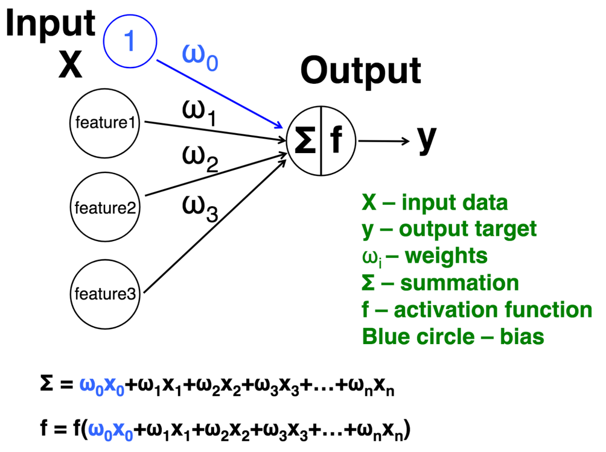

```{r setup, include=FALSE}
options(htmltools.dir.version = FALSE)
```

class: center, middle

# "It’s tough to make predictions, especially about the future." -Yogi Berra

---

class: left, middle

# Download the workshop materials 

### 1) Download the workshiop materials: https://github.com/dlab-berkeley/Machine-Learning-in-R  

### 2) Download R > 3.5: https://cloud.r-project.org/  

### 3) Download RStudio Desktop Open Source License FREE: https://www.rstudio.com/products/rstudio/download/

---

class: left

# Workshop Goals

### Introduction  
### Part 1. MNIST handwritten digit classification example  
### Part 2. Dogs-humans example  
### Part 3. Biomedical example  
### Part 4. Cloud example

---

# What is deep learning? (long definition)

#### Deep Learning allows "computers to learn from experience and understand the world in terms of a hierarchy of concepts, with each concept defined through its relation to simpler concepts. By gathering knowledge from experience, this approach avoids the need for human operators to formally specify all the knowledge that the computer needs.  

#### The hierarchy of concepts enables the computer to learn complicated concepts bybuilding them out of simpler ones. If we draw a graph showing how these concepts are built on top of each other, the graph is deep, with many layers. For this reason, we call this approach to AI deep learning." (https://www.deeplearningbook.org/contents/intro.html, pp. 1-2)

---

# What is deep learning? (short definition)

#### A subfield of machine learning that utilizes multi-layered artificial neural networks for modelling and prediction of data. 

---

class: center

# What is an artificial neural network? 

```{r, out.width = "600px", echo = F}

```

---

## What makes a network "deep"?

---